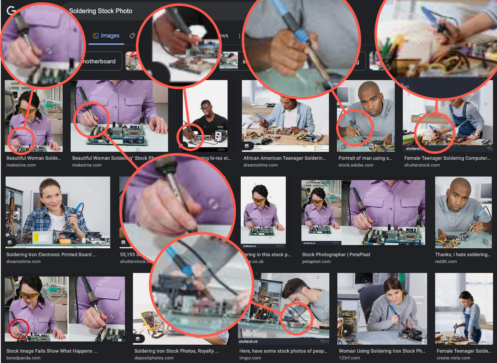

# A Software Engineers Guide to Soldering

I put this together for hardware hackers and software engineers to pick up soldering quickly and without too much fuss.

Pull Requests are welcome!

## Getting your soldering environment up and running

First, need to get your soldering station up and running. There are a couple important pieces of kit that everyone should own:

**Tools/Equipment:**

1) Soldering iron (and tips)
1) Fume extractor
1) Hot air rework station
1) Flush cut snips
1) Heat proof mat

**Consumables:**

1) Solder
1) Acid-free flux
1) Solder wick
1) Tip cleaner (sponge or brass)
1) Tip tinner (for maintenance)
1) Alcohol (99% is best!)
1) Q Tips

You probably also want to get a couple practice pieces to test/validate your techniques. I recommend picking up some perfboard or protoboard.

<!-- TODO: Add photo of iron/ventilation/consumables -->

## Soldering Basics

In the context of electronics, soldering is a process where you join 2 pieces of metal, like a wire and a copper trace on a PCB and bond them using a filler material (solder). In electronics, solder is nearly always going to be a tin based, containing lead, silver or copper to reduce the formation of tin whiskers and reduce the melting temperature. Heat is applied via a soldering iron that transmits heat physically or a hot air station that blows hot air over the workpiece.

The most important thing you should know about soldering is that nearly all results of soldering are dependent on good heat management. If the process is done correctly, the solder will "wet" between the 2 pieces of metal, creating a physical and electrical bond. When not enough heat is applied to one or both pieces of metal (referred to as a cold solder joint), solder might not create a good bond with the metal. When a poor bond is created, temperature differences, physical movement can all cause the joint to fail entirely or have a poor electrical connection.

Different materials used in electronics have different melting points so it is important for someone picking up this skill to be able to consistently control how much heat goes into a workpiece as well as the amount of time heat is applied. [IPC-J-STD-001H](https://shop.ipc.org/general-electronics/j001-0-h-english) and [IPC-A-610](https://www.ipc.org/ipc-610-acceptability-electronics-assemblies-endorsement-program) help define standards for acceptable soldered connections. 

<!-- TODO: Photo with good joint/bad joint -->
<!-- https://www.protoexpress.com/blog/ipc-j-std-001-standard-soldering-requirements/ -->

### Material Selection

One of the most important decisions you make is what kind of solder/flux you choose to use. PCB material, components and wire insulation materials will also have an impact on soldering techniques, heat times and temperatures.

#### Solder

Personally, I recommend people who are beginning to solder to start with leaded solder, since it is significantly easier to work with. 60/40 & 63/37 rosin core solder are my go-tos. Leaded solder gives you a much wider range of acceptable results due to the low melting point of leaded solder. However leaded solder can have harmful health and environmental impact, notably it is *really* bad to eat/ingest it.

Additionally, [ROHS](https://en.wikipedia.org/wiki/Restriction_of_Hazardous_Substances_Directive) requires electronic products sold in europe be lead-free, whereas in the US there are various laws which restrict the usage of lead in consumer products. 

A general rule of thumb, is that if you are developing a product or selling something, you will need to go with lead free solder, if its for personal projects, it can be easier to use leaded. Additionally, you never want to mix equipment between leaded and unleaded, because that will contaminate your lead free soldering equipment.

Solder also comes in different widths, which will be determined by how much solder you need to apply. Small surface mount components can benefit from thinner solder.

#### Wire

### Ventilation / Safety

Its important to keep your lungs healthy when soldering. A good fume extractor is a must-have and should be used whenever you are soldering, even if you are using lead free solder. Remember, you are melting metal onto fiberglass boards containing epoxies, glass fibers and resins. I'm no scientist, but can definitely say it isn't good to inhale that stuff.

When working with leaded solder, make sure never to eat/drink where you are soldering. Remember to wash your hands after working with leaded solder and try not to use things that you may come in contact with later (for example, a keyboard or mouse). I always recommend wearing gloves when possible, mainly to remind yourself that you have potentially hazardous materials on your hands.

Also, don't let stock photos show you proper iron techniques.

### Heat Management

Soldering irons use different methods for heating the iron. Most soldering irons will also feature replacable tips. Generally, what you pay for when you purchase irons is how quickly the iron will get to temperature, how easily it will keep that temperature and how repeatable that temperature is. Personally, I am of the opinion that you can get fairly reasonable results with a cheap-o iron. Knowing what I know now, I wouldn't have ever bothered with irons in the $50-$200 range.

However, once you start doing surface mount work with small components, having better ergonomics and more control of the heat become much more important. If cost is a concern, start with a cheap iron, a used iron or an iron that takes nicer tips.

### Soldering Iron Tip Selection

Different styles of tips work well in different conditions. One common mistake people make is grabbing the smallest tip and wondering why it is difficult to work with. I typically avoid traditional conical tips,  My favorite tips are curved, which give me flexibility of working in small SMD components, while using the outer edge for larger/thicker components. Between a blade style tip and a curved tip, there are very few things that I *can't* solder.

### Cleaning

You should make it a habit to clean anything that has flux, even no clean flux can attract dust or degrade over time.

## Soldering Techniques

Generally, you want to 

### Good Joints

### Bad Joints

### Wire to board

### Wire to wire

### Surface mount

#### Large pads

#### SOIC

#### QFP

#### QFN

#### Hot air

## Desoldering Techniques

<!-- TODO: Photo of solder wick on through hole -->

## Tips & Tricks

 - Watch the solder puddle, this will give you a good idea on the quality of the joint
 - Always have your workpiece where you want it, before you start soldering
 - When soldering wires together, tin your wires and make sure they are touching

<!-- TODO: Add photo of good vs. bad wire positioning -->

## Product Recommendations

### Hand Tools

 - CHP Flush Cut Snips

### Soldering Irons

- [Weller WE1010NA](https://www.amazon.com/Weller-WE1010NA-Digital-Soldering-Station/dp/B077JDGY1J/) $90-110
- [Hakko FX951](https://www.amazon.com/AMERICAN-HAKKO-PRODUCTS-INC-FX-951/dp/B0012B8NW8) $250-$300
- [Thermaltronics TMT-9000S](http://www.thermaltronics.com/tmt-9000s.php?item_number=TMT-9000S-1) $400-$500

### Consumables

#### Solder
 - MG Chem 63/37
 - Nihon SN100c

#### Solder Wick
 - MG Chemicals SuperWick

### Accessories

## Advanced Kit

If you want to do more advanced or surface mount work additional tools can be helpful:

1) Hot air station
2) Stereo microscope
3) Solder tweezers
4) Reflow oven
5) Ultrasonic cleaner
6) Solder paste
7) Reball jig
